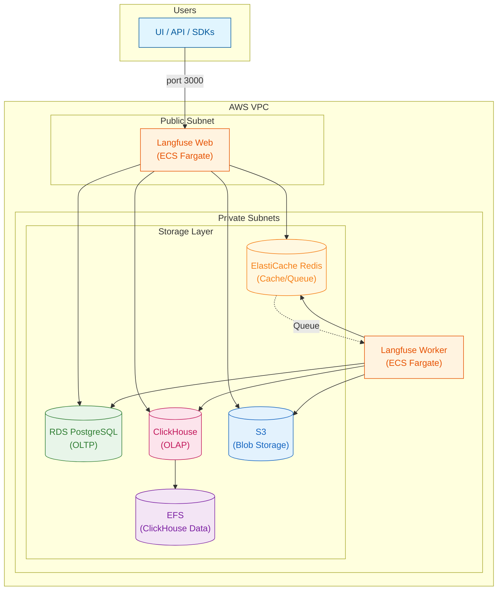
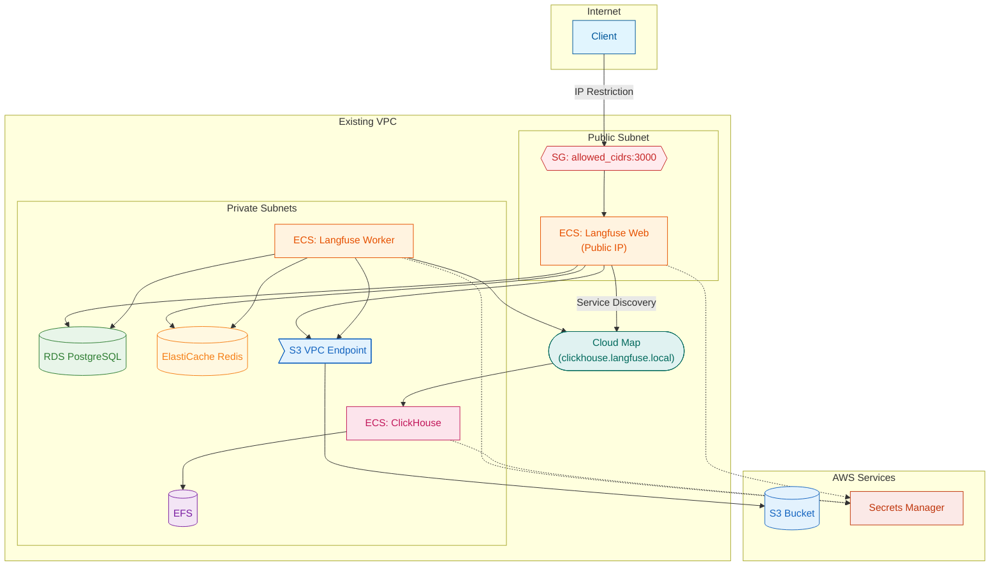

# Terraform AWS Langfuse ECS

Terraform module for self-hosting Langfuse v3 on AWS ECS Fargate.

## Overview

This project provides a Terraform configuration to deploy Langfuse v3 on AWS in a simple and cost-effective manner.

### Features

- **No Kubernetes required** - Simple operation with ECS Fargate
- **HTTPS by default** - ALB + self-signed certificate (or ACM certificate for production)
- **Auto-create VPC or use existing** - Flexible network configuration
- **Secure access control** - IP restriction via Security Groups
- **Data persistence** - ClickHouse data persisted on EFS
- **Cost optimization** - ARM64 (Graviton), S3 Intelligent-Tiering, VPC Endpoints (no NAT Gateway)

## Architecture

### Langfuse Component Structure



### AWS Infrastructure



For details, see [docs/architecture.md](docs/architecture.md).

## Prerequisites

- Terraform >= 1.0
- AWS CLI (configured with credentials)
- Docker (for pushing images to ECR)
- ECR repositories (must be created beforehand)
- Existing VPC (optional) - auto-created if not specified

## Quick Start

### 1. Clone the repository

```bash
git clone https://github.com/myui/terraform-aws-langfuse-ecs.git
cd terraform-aws-langfuse-ecs
```

### 2. Create tfvars file

```bash
cp tfvars/example.tfvars tfvars/dev.tfvars
```

Edit `tfvars/dev.tfvars`:

### 3. Create ECR repositories (outside Terraform)

```bash
# Create ECR repositories
aws ecr create-repository --repository-name langfuse-dev/web --tags Key=user,Value=YOUR_NAME
aws ecr create-repository --repository-name langfuse-dev/worker --tags Key=user,Value=YOUR_NAME
aws ecr create-repository --repository-name langfuse-dev/clickhouse --tags Key=user,Value=YOUR_NAME
```

### 4. Push container images to ECR

```bash
# Use the script to push images
./scripts/push-images.sh <aws_account_id> <aws_region> langfuse-dev

# Example:
./scripts/push-images.sh 123456789012 ap-northeast-1 langfuse-dev
```

This script will:
- Pull `langfuse/langfuse:3`, `langfuse/langfuse-worker:3`, `clickhouse/clickhouse-server:24` from Docker Hub
- Login to ECR
- Push images to ECR

### 5. Edit tfvars file

Edit `tfvars/dev.tfvars`:

```hcl
# AWS Configuration
aws_region   = "ap-northeast-1"
service_name = "langfuse"
user         = "your-name"

# Container Images (ECR URLs)
langfuse_web_image    = "123456789012.dkr.ecr.ap-northeast-1.amazonaws.com/langfuse-dev/web:3"
langfuse_worker_image = "123456789012.dkr.ecr.ap-northeast-1.amazonaws.com/langfuse-dev/worker:3"
clickhouse_image      = "123456789012.dkr.ecr.ap-northeast-1.amazonaws.com/langfuse-dev/clickhouse:24"

# Network Configuration
# Option A: Auto-create VPC
vpc_cidr = "10.0.0.0/16"

# Option B: Use existing VPC
# vpc_id             = "vpc-xxxxxxxxxxxxxxxxx"
# public_subnet_ids  = ["subnet-xxxxxxxxxxxxxxxxx"]
# private_subnet_ids = ["subnet-xxxxxxxxxxxxxxxxx", "subnet-yyyyyyyyyyyyyyyyy"]

# Access Control (IP ranges allowed to access)
allowed_cidrs = ["203.0.113.0/24"]
```

### 6. Run Terraform

```bash
cd infra

# Initialize
terraform init

# export AWS_PROFILE=rd:engineering

# Review plan
terraform plan -var-file=../tfvars/dev.tfvars

# Deploy
terraform apply -var-file=../tfvars/dev.tfvars
```

### 7. Get Access URL

After deployment, get the access URL from Terraform output:

```bash
terraform output langfuse_url
```

#### With ALB (default)

```bash
# Get ALB DNS name
terraform output alb_dns_name
```

Example output: `langfuse-alb-123456789.us-east-1.elb.amazonaws.com`

#### Without ALB (Public IP mode)

```bash
# Set region (e.g., us-east-1)
REGION=us-east-1

aws ecs list-tasks --region $REGION --cluster langfuse --service-name langfuse-web --query 'taskArns[0]' --output text | \
xargs -I {} aws ecs describe-tasks --region $REGION --cluster langfuse --tasks {} --query 'tasks[0].attachments[0].details[?name==`networkInterfaceId`].value' --output text | \
xargs -I {} aws ec2 describe-network-interfaces --region $REGION --network-interface-ids {} --query 'NetworkInterfaces[0].Association.PublicIp' --output text
```

### 8. Access Langfuse

| Mode | Access URL | Notes |
|------|------------|-------|
| ALB + self-signed cert (default) | `https://<alb-dns-name>` | Browser shows certificate warning |
| ALB + ACM certificate | `https://<alb-dns-name>` or `https://<custom-domain>` | Recommended for production |
| ALB disabled | `http://<public-ip>:3000` | IP is dynamic (changes on task restart) |

**Note**: When using self-signed certificate, you need to accept the browser security warning on first access.

## Variables

| Variable | Description | Default |
|----------|-------------|---------|
| `aws_region` | AWS region | - |
| `service_name` | Resource naming prefix and tag | `langfuse` |
| `user` | User tag for resource identification | - |
| `vpc_id` | Existing VPC ID (auto-created if null) | `null` |
| `public_subnet_ids` | Public Subnet IDs (required if vpc_id specified) | `null` |
| `private_subnet_ids` | Private Subnet IDs (required if vpc_id specified) | `null` |
| `vpc_cidr` | CIDR for new VPC (only used when auto-creating) | `10.0.0.0/16` |
| `allowed_cidrs` | Allowed CIDR list for access | - |
| `db_instance_class` | RDS instance class | `db.t4g.micro` |
| `db_multi_az` | Enable RDS Multi-AZ | `false` |
| `cache_node_type` | ElastiCache node type | `cache.t4g.micro` |
| `web_cpu` | Web task CPU | `1024` |
| `web_memory` | Web task memory (MB) | `2048` |
| `worker_desired_count` | Worker task count | `1` |
| `worker_cpu` | Worker task CPU | `1024` |
| `worker_memory` | Worker task memory (MB) | `2048` |
| `clickhouse_cpu` | ClickHouse task CPU | `2048` |
| `clickhouse_memory` | ClickHouse task memory (MB) | `4096` |
| `enable_alb` | Enable ALB for HTTPS | `true` |
| `certificate_arn` | ACM certificate ARN (self-signed if empty) | `""` |
| `custom_domain` | Custom domain (e.g., langfuse.example.com) | `""` |
| `route53_zone_id` | Route53 hosted zone ID (required with custom_domain) | `""` |

## Outputs

| Output | Description |
|--------|-------------|
| `vpc_id` | VPC ID (created or existing) |
| `public_subnet_ids` | Public Subnet IDs |
| `private_subnet_ids` | Private Subnet IDs |
| `ecs_cluster_name` | ECS cluster name |
| `langfuse_web_service_name` | Web service name |
| `rds_endpoint` | RDS endpoint |
| `redis_endpoint` | Redis endpoint |
| `s3_bucket_name` | S3 bucket name |
| `clickhouse_dns` | ClickHouse internal DNS name |
| `alb_dns_name` | ALB DNS name (when ALB enabled) |
| `langfuse_url` | Langfuse access URL |

## Remote State Management (Optional)

Store Terraform state in S3 with native state locking (Terraform >= 1.10).

### 1. Create S3 bucket for state

```bash
cd bootstrap
terraform init
terraform apply -var="bucket_name=langfuse-infra-tf-state" -var="aws_region=us-east-1" -var="user=your-name"
```

### 2. Configure backend

Edit `infra/backend.tf` and uncomment the backend block:

```hcl
terraform {
  backend "s3" {
    bucket       = "langfuse-infra-tf-state"
    key          = "langfuse/terraform.tfstate"
    region       = "us-east-1"
    use_lockfile = true  # Native S3 state locking
    encrypt      = true
  }
}
```

### 3. Migrate state

```bash
cd infra
terraform init -migrate-state
```

## Destroy Resources

```bash
cd infra
terraform destroy -var-file=../tfvars/dev.tfvars
```

**Note**: Since `skip_final_snapshot = true` for RDS, no snapshot will be created on deletion. Consider changing this for production environments.

## Cost Estimate (Tokyo Region)

Estimated monthly cost for minimum configuration:

| Service | Configuration | Est. Cost |
|---------|---------------|-----------|
| ECS Fargate | 3 tasks (4 vCPU, 8 GB) | ~$100 |
| RDS PostgreSQL | db.t4g.micro | ~$15 |
| ElastiCache Redis | cache.t4g.micro | ~$12 |
| EFS | 10 GB | ~$3 |
| S3 | 10 GB + Intelligent-Tiering | ~$1 |
| **Total** | | **~$130/month** |

*Data transfer and CloudWatch logs are not included.

## Security Considerations

- All sensitive information managed in AWS Secrets Manager
- S3 with public access completely blocked + encryption
- RDS/ElastiCache placed in Private Subnets
- EFS with transit encryption enabled
- Security Groups with least privilege access
- ALB HTTPS termination (TLS 1.3)
- HTTP to HTTPS automatic redirect

## Future Enhancements

- Static IP (NLB + Elastic IP)
- Auto Scaling (ECS Service Auto Scaling)
- Enhanced monitoring (CloudWatch Container Insights)

## License

Apache License 2.0

## Related Links

- [Langfuse Official Documentation](https://langfuse.com/docs)
- [Langfuse Self-Hosting Guide](https://langfuse.com/docs/deployment/self-host)
