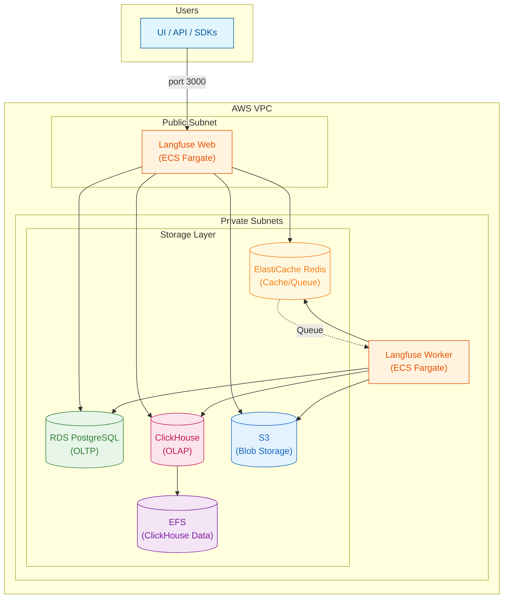
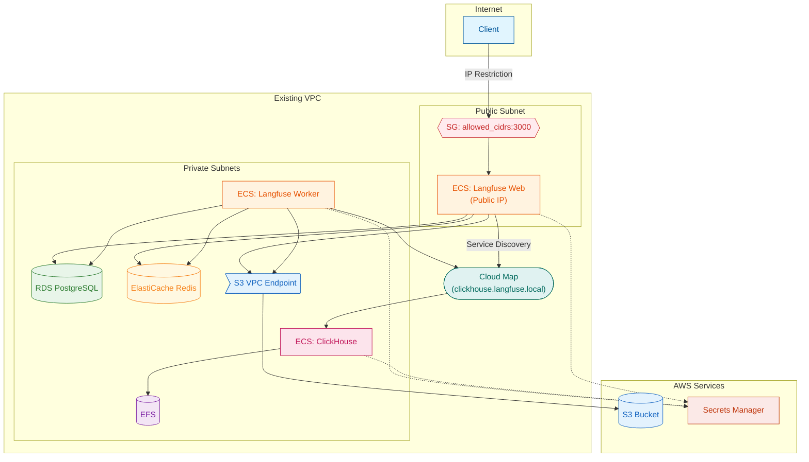

# Terraform AWS Langfuse ECS

Terraform module for self-hosting Langfuse v3 on AWS ECS Fargate.

## Overview

This project provides a Terraform configuration to deploy Langfuse v3 on AWS in a simple and cost-effective manner.

### Features

- **No Kubernetes required** - Simple operation with ECS Fargate
- **HTTPS by default** - ALB + self-signed certificate (or ACM certificate for production)
- **Auto-create VPC or use existing** - Flexible network configuration
- **Secure access control** - IP restriction and/or Security Group-based access via ALB
- **Data persistence** - ClickHouse data persisted on EFS
- **Cost optimization** - ARM64 (Graviton), S3 Intelligent-Tiering, VPC Endpoints (no NAT Gateway)

## Architecture

### Langfuse Component Structure


```mermaid
flowchart TB
    subgraph Users["Users"]
        UI["UI / API / SDKs"]
    end

    subgraph VPC["AWS VPC"]
        subgraph Public["Public Subnet"]
            Web["Langfuse Web<br/>(ECS Fargate)"]
        end

        subgraph Private["Private Subnets"]
            Worker["Langfuse Worker<br/>(ECS Fargate)"]

            subgraph Storage["Storage Layer"]
                Postgres[("RDS PostgreSQL<br/>(OLTP)")]
                ClickHouse[("ClickHouse<br/>(OLAP)")]
                Redis[("ElastiCache Redis<br/>(Cache/Queue)")]
                S3[("S3<br/>(Blob Storage)")]
                EFS[("EFS<br/>(ClickHouse Data)")]
            end
        end
    end

    UI -->|"port 3000"| Web
    Web --> Postgres
    Web --> ClickHouse
    Web --> Redis
    Web --> S3
    Worker --> Postgres
    Worker --> ClickHouse
    Worker --> Redis
    Worker --> S3
    Redis -.->|"Queue"| Worker
    ClickHouse --> EFS

    style UI fill:#e1f5fe,stroke:#01579b,color:#01579b
    style Web fill:#fff3e0,stroke:#e65100,color:#e65100
    style Worker fill:#fff3e0,stroke:#e65100,color:#e65100
    style Postgres fill:#e8f5e9,stroke:#2e7d32,color:#2e7d32
    style ClickHouse fill:#fce4ec,stroke:#c2185b,color:#c2185b
    style Redis fill:#fff8e1,stroke:#f57f17,color:#f57f17
    style S3 fill:#e3f2fd,stroke:#1565c0,color:#1565c0
    style EFS fill:#f3e5f5,stroke:#7b1fa2,color:#7b1fa2
```

### AWS Infrastructure


```mermaid
flowchart TB
    subgraph Internet["Internet"]
        Client["Client"]
    end

    subgraph VPC["Existing VPC"]
        subgraph PublicSubnet["Public Subnet"]
            WebSG{{"SG: allowed_cidrs:3000"}}
            WebECS["ECS: Langfuse Web<br/>(Public IP)"]
        end

        subgraph PrivateSubnets["Private Subnets"]
            WorkerECS["ECS: Langfuse Worker"]
            CHECS["ECS: ClickHouse"]

            RDS[("RDS PostgreSQL")]
            ElastiCache[("ElastiCache Redis")]
            EFSStorage[("EFS")]
            S3Endpoint>"S3 VPC Endpoint"]
        end

        CloudMap(["Cloud Map<br/>(clickhouse.langfuse.local)"])
    end

    subgraph AWSServices["AWS Services"]
        S3Bucket[("S3 Bucket")]
        SecretsManager["Secrets Manager"]
    end

    Client -->|"IP Restriction"| WebSG --> WebECS
    WebECS --> RDS
    WebECS --> ElastiCache
    WebECS -->|"Service Discovery"| CloudMap --> CHECS
    WorkerECS --> RDS
    WorkerECS --> ElastiCache
    WorkerECS --> CloudMap
    CHECS --> EFSStorage
    WebECS --> S3Endpoint --> S3Bucket
    WorkerECS --> S3Endpoint
    WebECS -.-> SecretsManager
    WorkerECS -.-> SecretsManager
    CHECS -.-> SecretsManager

    style Client fill:#e1f5fe,stroke:#01579b,color:#01579b
    style WebSG fill:#ffebee,stroke:#c62828,color:#c62828
    style WebECS fill:#fff3e0,stroke:#e65100,color:#e65100
    style WorkerECS fill:#fff3e0,stroke:#e65100,color:#e65100
    style CHECS fill:#fce4ec,stroke:#c2185b,color:#c2185b
    style RDS fill:#e8f5e9,stroke:#2e7d32,color:#2e7d32
    style ElastiCache fill:#fff8e1,stroke:#f57f17,color:#f57f17
    style EFSStorage fill:#f3e5f5,stroke:#7b1fa2,color:#7b1fa2
    style S3Endpoint fill:#e3f2fd,stroke:#1565c0,color:#1565c0
    style S3Bucket fill:#e3f2fd,stroke:#1565c0,color:#1565c0
    style CloudMap fill:#e0f2f1,stroke:#00695c,color:#00695c
    style SecretsManager fill:#fbe9e7,stroke:#bf360c,color:#bf360c
```

For details, see [docs/architecture.md](docs/architecture.md).

## Prerequisites

- Terraform >= 1.0
- AWS CLI (configured with credentials)
- Docker (ClickHouse イメージの初回プッシュ時のみ必要)
- GitHub repository (`moji-inc/ai-eval`) with Actions enabled
- Existing VPC (optional) - auto-created if not specified

## Quick Start

### 1. Clone the repository

```bash
git clone https://github.com/moji-inc/terraform-aws-langfuse-ecs.git
cd terraform-aws-langfuse-ecs
```

### 2. Create tfvars file

```bash
cp tfvars/example.tfvars tfvars/dev.tfvars
```

Edit `tfvars/dev.tfvars`:

```hcl
# AWS Configuration
aws_region   = "ap-northeast-1"
service_name = "langfuse"
user         = "your-name"

# GitHub Actions OIDC (required)
github_repo = "moji-inc/ai-eval"

# Network Configuration
# Option A: Auto-create VPC
vpc_cidr = "10.0.0.0/16"

# Option B: Use existing VPC
# vpc_id             = "vpc-xxxxxxxxxxxxxxxxx"
# public_subnet_ids  = ["subnet-xxxxxxxxxxxxxxxxx"]
# private_subnet_ids = ["subnet-xxxxxxxxxxxxxxxxx", "subnet-yyyyyyyyyyyyyyyyy"]

# Access Control (IP ranges allowed to access)
allowed_cidrs = ["203.0.113.0/24"]
```

**Note**: Container image variables (`langfuse_web_image`, `langfuse_worker_image`, `clickhouse_image`) are optional. If omitted, ECR `:latest` tags are used (pushed by GitHub Actions and `scripts/push-images.sh`).

### 3. Run Terraform

```bash
cd infra

# Initialize
terraform init

# Review plan
terraform plan -var-file=../tfvars/dev.tfvars

# Deploy (creates ECR repositories, ECS cluster, RDS, ALB, GitHub Actions OIDC role, etc.)
terraform apply -var-file=../tfvars/dev.tfvars
```

### 4. Push ClickHouse image to ECR

ClickHouse is an official image (no custom build). Push it to ECR once:

```bash
./scripts/push-images.sh <aws_account_id> <aws_region> langfuse

# Example:
./scripts/push-images.sh 123456789012 ap-northeast-1 langfuse
```

### 5. Set up GitHub Actions Variables

Set the following Variables in `moji-inc/ai-eval` repository (Settings > Secrets and variables > Actions > Variables):

| Variable | Value (from `terraform output`) |
|----------|--------------------------------|
| `AWS_ROLE_ARN` | `github_actions_role_arn` |
| `AWS_REGION` | e.g., `ap-northeast-1` |
| `SERVICE_NAME` | e.g., `langfuse` |
| `ECS_CLUSTER_NAME` | `ecs_cluster_name` |
| `ECS_WEB_SERVICE_NAME` | `langfuse_web_service_name` |
| `ECS_WORKER_SERVICE_NAME` | `langfuse_worker_service_name` |

### 6. Run initial deployment via GitHub Actions

Go to `moji-inc/ai-eval` repository > Actions > "Deploy to ECS" > Run workflow (`workflow_dispatch`).

This builds `ai-eval` web/worker images from source and deploys them to ECS. Subsequent pushes to `main` trigger this automatically.

### 7. Get Access URL

After deployment, get the access URL from Terraform output:

```bash
terraform output langfuse_url
```

#### With ALB (default)

```bash
# Get ALB DNS name
terraform output alb_dns_name
```

Example output: `langfuse-alb-123456789.us-east-1.elb.amazonaws.com`

#### Without ALB (Public IP mode)

```bash
# Set region (e.g., us-east-1)
REGION=us-east-1

aws ecs list-tasks --region $REGION --cluster langfuse --service-name langfuse-web --query 'taskArns[0]' --output text | \
xargs -I {} aws ecs describe-tasks --region $REGION --cluster langfuse --tasks {} --query 'tasks[0].attachments[0].details[?name==`networkInterfaceId`].value' --output text | \
xargs -I {} aws ec2 describe-network-interfaces --region $REGION --network-interface-ids {} --query 'NetworkInterfaces[0].Association.PublicIp' --output text
```

### 8. Access Langfuse

| Mode | Access URL | Notes |
|------|------------|-------|
| ALB + self-signed cert (default) | `https://<alb-dns-name>` | Browser shows certificate warning |
| ALB + ACM certificate | `https://<alb-dns-name>` or `https://<custom-domain>` | Recommended for production |
| ALB disabled | `http://<public-ip>:3000` | IP is dynamic (changes on task restart) |

**Note**: When using self-signed certificate, you need to accept the browser security warning on first access.

### 9. Set nextauth_url and Redeploy

After the initial deployment, once the ALB DNS name is determined, set `nextauth_url` and redeploy.
This is required for Langfuse authentication (login, session management) to work properly.

```bash
# Get ALB DNS name
terraform output alb_dns_name
```

Edit `tfvars/dev.tfvars`:

```hcl
# With ALB (default)
nextauth_url = "https://<alb-dns-name>"

# With custom domain
# nextauth_url = "https://langfuse.example.com"
```

Redeploy:

```bash
terraform apply -var-file=../tfvars/dev.tfvars
```

## Variables

| Variable | Description | Default |
|----------|-------------|---------|
| `aws_region` | AWS region | - |
| `service_name` | Resource naming prefix and tag | `langfuse` |
| `user` | User tag for resource identification | - |
| `github_repo` | GitHub repository for OIDC auth (e.g., `moji-inc/ai-eval`) | - |
| `vpc_id` | Existing VPC ID (auto-created if null) | `null` |
| `public_subnet_ids` | Public Subnet IDs (required if vpc_id specified) | `null` |
| `private_subnet_ids` | Private Subnet IDs (required if vpc_id specified) | `null` |
| `vpc_cidr` | CIDR for new VPC (only used when auto-creating) | `10.0.0.0/16` |
| `allowed_cidrs` | Allowed CIDR list for access | - |
| `allowed_security_group_ids` | Security group IDs allowed to access ALB via HTTPS | `[]` |
| `langfuse_web_image` | Web container image (null = ECR `:latest`) | `null` |
| `langfuse_worker_image` | Worker container image (null = ECR `:latest`) | `null` |
| `clickhouse_image` | ClickHouse container image (null = ECR `:latest`) | `null` |
| `db_instance_class` | RDS instance class | `db.t4g.micro` |
| `db_multi_az` | Enable RDS Multi-AZ | `false` |
| `cache_node_type` | ElastiCache node type | `cache.t4g.micro` |
| `web_cpu` | Web task CPU | `1024` |
| `web_memory` | Web task memory (MB) | `2048` |
| `worker_desired_count` | Worker task count | `1` |
| `worker_cpu` | Worker task CPU | `1024` |
| `worker_memory` | Worker task memory (MB) | `2048` |
| `clickhouse_cpu` | ClickHouse task CPU | `2048` |
| `clickhouse_memory` | ClickHouse task memory (MB) | `4096` |
| `enable_alb` | Enable ALB for HTTPS | `true` |
| `certificate_arn` | ACM certificate ARN (self-signed if empty) | `""` |
| `custom_domain` | Custom domain (e.g., langfuse.example.com) | `""` |
| `route53_zone_id` | Route53 hosted zone ID (required with custom_domain) | `""` |

## Outputs

| Output | Description |
|--------|-------------|
| `vpc_id` | VPC ID (created or existing) |
| `public_subnet_ids` | Public Subnet IDs |
| `private_subnet_ids` | Private Subnet IDs |
| `ecs_cluster_name` | ECS cluster name |
| `langfuse_web_service_name` | Web service name |
| `langfuse_worker_service_name` | Worker service name |
| `rds_endpoint` | RDS endpoint |
| `redis_endpoint` | Redis endpoint |
| `s3_bucket_name` | S3 bucket name |
| `clickhouse_dns` | ClickHouse internal DNS name |
| `alb_dns_name` | ALB DNS name (when ALB enabled) |
| `langfuse_url` | Langfuse access URL |
| `ecr_web_repository_url` | ECR Web repository URL |
| `ecr_worker_repository_url` | ECR Worker repository URL |
| `ecr_clickhouse_repository_url` | ECR ClickHouse repository URL |
| `github_actions_role_arn` | GitHub Actions OIDC IAM role ARN |

## Remote State Management (Optional)

Store Terraform state in S3 with native state locking (Terraform >= 1.10).

### 1. Create S3 bucket for state

```bash
cd bootstrap
terraform init
terraform apply -var="bucket_name=langfuse-infra-tf-state" -var="aws_region=us-east-1" -var="user=your-name"
```

### 2. Configure backend

Edit `infra/backend.tf` and uncomment the backend block:

```hcl
terraform {
  backend "s3" {
    bucket       = "langfuse-infra-tf-state"
    key          = "langfuse/terraform.tfstate"
    region       = "us-east-1"
    use_lockfile = true  # Native S3 state locking
    encrypt      = true
  }
}
```

### 3. Migrate state

```bash
cd infra
terraform init -migrate-state
```

## Destroy Resources

```bash
cd infra
terraform destroy -var-file=../tfvars/dev.tfvars
```

**Note**:
- Since `skip_final_snapshot = true` for RDS, no snapshot will be created on deletion. Consider changing this for production environments.
- ECR repositories have `force_delete = false`. If images exist, delete them first: `aws ecr delete-repository --repository-name langfuse/web --force` (repeat for `worker` and `clickhouse`).

## Cost Estimate (Tokyo Region)

Estimated monthly cost for minimum configuration:

| Service | Configuration | Est. Cost |
|---------|---------------|-----------|
| ECS Fargate | 3 tasks (4 vCPU, 8 GB) | ~$100 |
| RDS PostgreSQL | db.t4g.micro | ~$15 |
| ElastiCache Redis | cache.t4g.micro | ~$12 |
| EFS | 10 GB | ~$3 |
| S3 | 10 GB + Intelligent-Tiering | ~$1 |
| **Total** | | **~$130/month** |

*Data transfer and CloudWatch logs are not included.

## Security Considerations

- All sensitive information managed in AWS Secrets Manager
- S3 with public access completely blocked + encryption
- RDS/ElastiCache placed in Private Subnets
- EFS with transit encryption enabled
- Security Groups with least privilege access
- ALB HTTPS termination (TLS 1.3)
- Both HTTP and HTTPS accessible (no forced redirect)

## Future Enhancements

- Static IP (NLB + Elastic IP)
- Auto Scaling (ECS Service Auto Scaling)
- Enhanced monitoring (CloudWatch Container Insights)

## License

Apache License 2.0

## Related Links

- [Langfuse Official Documentation](https://langfuse.com/docs)
- [Langfuse Self-Hosting Guide](https://langfuse.com/docs/deployment/self-host)
