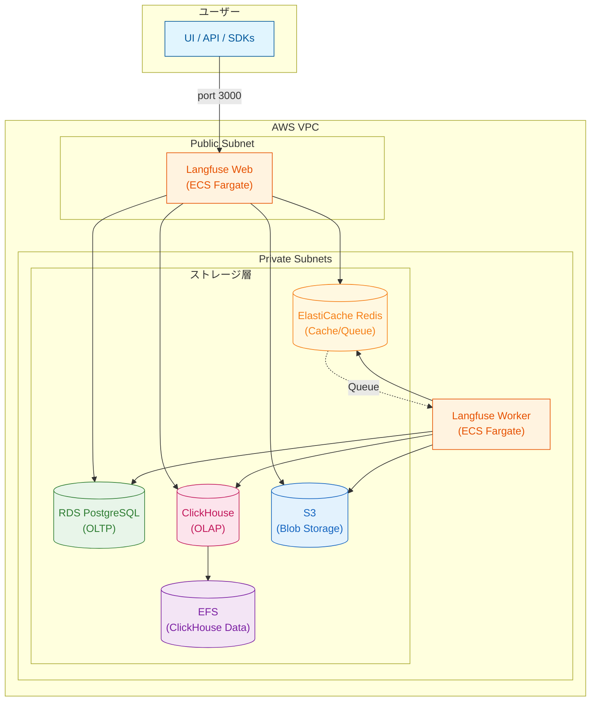
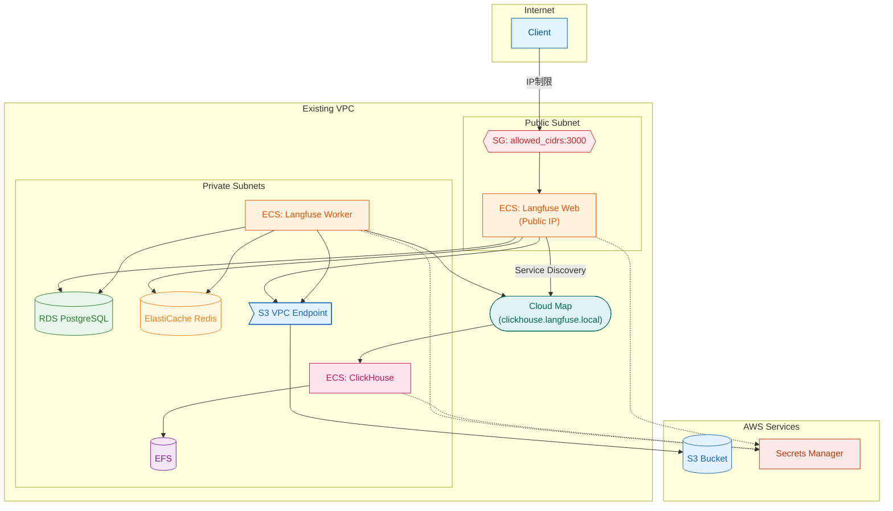

# Terraform AWS Langfuse ECS

AWS ECS Fargate 上に Langfuse v3 をセルフホスティングするための Terraform モジュール。

## 概要

このプロジェクトは、Langfuse v3 を AWS 上にシンプルかつ低コストでデプロイするための Terraform 構成を提供します。

### 特徴

- **Kubernetes 不要** - ECS Fargate ベースでシンプルな運用
- **VPC 自動作成または既存 VPC 利用** - 柔軟なネットワーク構成
- **セキュアなアクセス制御** - Security Group による IP 制限
- **データ永続化** - ClickHouse データは EFS に永続化
- **コスト最適化** - S3 Intelligent-Tiering、VPC Endpoint 経由のアクセス

## アーキテクチャ

### Langfuse コンポーネント構成



### AWS インフラ構成



詳細は [docs/architecture_ja.md](docs/architecture_ja.md) を参照してください。

## 前提条件

- Terraform >= 1.0
- AWS CLI（認証設定済み）
- Docker（イメージのECRへのpush用）
- ECR リポジトリ（事前に作成が必要）
- 既存の VPC（オプション）- 指定しない場合は自動作成

## クイックスタート

### 1. リポジトリをクローン

```bash
git clone https://github.com/myui/terraform-aws-langfuse-ecs.git
cd terraform-aws-langfuse-ecs
```

### 2. tfvars ファイルを作成

```bash
cp tfvars/example.tfvars tfvars/dev.tfvars
```

`tfvars/dev.tfvars` を編集:

### 3. ECR リポジトリを作成（Terraform 外で事前に作成）

```bash
# ECR リポジトリを作成
aws ecr create-repository --repository-name langfuse-dev/web --tags Key=user,Value=YOUR_NAME
aws ecr create-repository --repository-name langfuse-dev/worker --tags Key=user,Value=YOUR_NAME
aws ecr create-repository --repository-name langfuse-dev/clickhouse --tags Key=user,Value=YOUR_NAME
```

### 4. コンテナイメージを ECR に push

```bash
# スクリプトを使用してイメージを push
./scripts/push-images.sh <aws_account_id> <aws_region> langfuse-dev

# 例:
./scripts/push-images.sh 123456789012 ap-northeast-1 langfuse-dev
```

このスクリプトは以下を実行します:
- Docker Hub から `langfuse/langfuse:3`, `langfuse/langfuse-worker:3`, `clickhouse/clickhouse-server:24` を pull
- ECR にログイン
- イメージを ECR に push

### 5. tfvars ファイルを編集

`tfvars/dev.tfvars` を編集:

```hcl
# AWS Configuration
aws_region   = "ap-northeast-1"
service_name = "langfuse"
user         = "your-name"

# Container Images (ECR URLs)
langfuse_web_image    = "123456789012.dkr.ecr.ap-northeast-1.amazonaws.com/langfuse-dev/web:3"
langfuse_worker_image = "123456789012.dkr.ecr.ap-northeast-1.amazonaws.com/langfuse-dev/worker:3"
clickhouse_image      = "123456789012.dkr.ecr.ap-northeast-1.amazonaws.com/langfuse-dev/clickhouse:24"

# Network Configuration
# オプション A: VPC を自動作成
vpc_cidr = "10.0.0.0/16"

# オプション B: 既存の VPC を使用
# vpc_id             = "vpc-xxxxxxxxxxxxxxxxx"
# public_subnet_ids  = ["subnet-xxxxxxxxxxxxxxxxx"]
# private_subnet_ids = ["subnet-xxxxxxxxxxxxxxxxx", "subnet-yyyyyyyyyyyyyyyyy"]

# Access Control (アクセスを許可する IP 範囲)
allowed_cidrs = ["203.0.113.0/24"]
```

### 6. Terraform 実行

```bash
cd infra

# 初期化
terraform init

# export AWS_PROFILE=rd:engineering

# プラン確認
terraform plan -var-file=../tfvars/dev.tfvars

# デプロイ
terraform apply -var-file=../tfvars/dev.tfvars
```

### 7. Public IP の確認

デプロイ完了後、ECS タスクの Public IP を確認:

```bash
# リージョンを設定（例: us-east-1）
REGION=us-east-1

aws ecs list-tasks --region $REGION --cluster langfuse --service-name langfuse-web --query 'taskArns[0]' --output text | \
xargs -I {} aws ecs describe-tasks --region $REGION --cluster langfuse --tasks {} --query 'tasks[0].attachments[0].details[?name==`networkInterfaceId`].value' --output text | \
xargs -I {} aws ec2 describe-network-interfaces --region $REGION --network-interface-ids {} --query 'NetworkInterfaces[0].Association.PublicIp' --output text
```

### 8. Langfuse にアクセス

ブラウザで `http://<public-ip>:3000` にアクセス。

## 変数一覧

| 変数 | 説明 | デフォルト |
|------|------|------------|
| `aws_region` | AWS リージョン | - |
| `service_name` | リソース命名プレフィックス・タグ | `langfuse` |
| `user` | リソース識別用ユーザータグ | - |
| `vpc_id` | 既存 VPC ID（null の場合は自動作成） | `null` |
| `public_subnet_ids` | Public Subnet IDs（vpc_id 指定時は必須） | `null` |
| `private_subnet_ids` | Private Subnet IDs（vpc_id 指定時は必須） | `null` |
| `vpc_cidr` | 新規 VPC の CIDR（VPC 自動作成時のみ使用） | `10.0.0.0/16` |
| `allowed_cidrs` | アクセス許可 CIDR リスト | - |
| `db_instance_class` | RDS インスタンスクラス | `db.t4g.micro` |
| `db_multi_az` | RDS Multi-AZ 有効化 | `false` |
| `cache_node_type` | ElastiCache ノードタイプ | `cache.t4g.micro` |
| `web_cpu` | Web タスク CPU | `1024` |
| `web_memory` | Web タスク メモリ (MB) | `2048` |
| `worker_desired_count` | Worker タスク数 | `1` |
| `worker_cpu` | Worker タスク CPU | `1024` |
| `worker_memory` | Worker タスク メモリ (MB) | `2048` |
| `clickhouse_cpu` | ClickHouse タスク CPU | `2048` |
| `clickhouse_memory` | ClickHouse タスク メモリ (MB) | `4096` |

## 出力

| 出力 | 説明 |
|------|------|
| `vpc_id` | VPC ID（作成または既存） |
| `public_subnet_ids` | Public Subnet IDs |
| `private_subnet_ids` | Private Subnet IDs |
| `ecs_cluster_name` | ECS クラスター名 |
| `langfuse_web_service_name` | Web サービス名 |
| `rds_endpoint` | RDS エンドポイント |
| `redis_endpoint` | Redis エンドポイント |
| `s3_bucket_name` | S3 バケット名 |
| `clickhouse_dns` | ClickHouse 内部 DNS 名 |

## リモート State 管理（オプション）

Terraform state を S3 に保存し、ネイティブの state ロック機能を使用（Terraform >= 1.10）。

### 1. State 用 S3 バケットを作成

```bash
cd bootstrap
terraform init
terraform apply -var="bucket_name=langfuse-infra-tf-state" -var="aws_region=us-east-1" -var="user=your-name"
```

### 2. Backend を設定

`infra/backend.tf` を編集し、backend ブロックのコメントを解除:

```hcl
terraform {
  backend "s3" {
    bucket       = "langfuse-infra-tf-state"
    key          = "langfuse/terraform.tfstate"
    region       = "us-east-1"
    use_lockfile = true  # ネイティブ S3 state ロック
    encrypt      = true
  }
}
```

### 3. State を移行

```bash
cd infra
terraform init -migrate-state
```

## リソース削除

```bash
cd infra
terraform destroy -var-file=../tfvars/dev.tfvars
```

**注意**: RDS の `skip_final_snapshot = true` のため、削除時にスナップショットは作成されません。本番環境では変更を検討してください。

## コスト見積もり（東京リージョン）

最小構成での概算（月額）:

| サービス | 構成 | 概算コスト |
|----------|------|------------|
| ECS Fargate | 3 タスク (4 vCPU, 8 GB) | ~$100 |
| RDS PostgreSQL | db.t4g.micro | ~$15 |
| ElastiCache Redis | cache.t4g.micro | ~$12 |
| EFS | 10 GB | ~$3 |
| S3 | 10 GB + Intelligent-Tiering | ~$1 |
| **合計** | | **~$130/月** |

※ データ転送量、CloudWatch ログ等は含まれていません。

## セキュリティ考慮事項

- すべての機密情報は AWS Secrets Manager で管理
- S3 はパブリックアクセス完全ブロック + 暗号化
- RDS/ElastiCache は Private Subnet に配置
- EFS は転送時暗号化有効
- Security Group で最小権限アクセス

## 今後の拡張

- HTTPS 対応（ALB + ACM）
- 固定 IP（NLB + Elastic IP）
- カスタムドメイン（Route53）
- Auto Scaling
- Terraform remote state（S3 + DynamoDB）

## ライセンス

Apache License 2.0

## 関連リンク

- [Langfuse 公式ドキュメント](https://langfuse.com/docs)
- [Langfuse Self-Hosting Guide](https://langfuse.com/docs/deployment/self-host)
