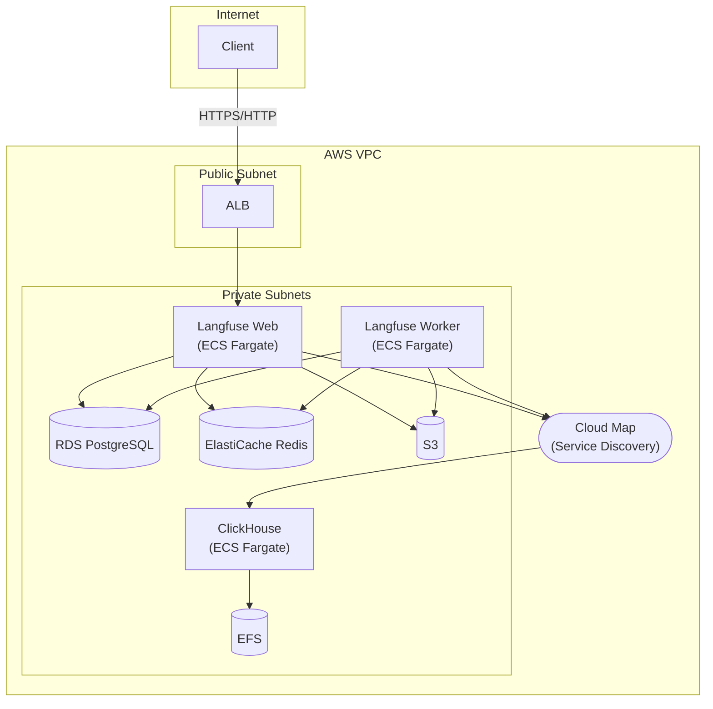

## Introduction

[Langfuse](https://langfuse.com/) is an Observability platform for LLM applications. It provides features such as tracing, evaluation, and prompt management to support the development and operation of LLM apps.

While Langfuse offers a cloud service version, there are cases where self-hosting is preferred for data privacy or cost reasons.

### Motivation

Langfuse's official [Self-Hosting Guide](https://langfuse.com/self-hosting/deployment/aws) introduces a Terraform module called [langfuse-terraform-aws](https://github.com/langfuse/langfuse-terraform-aws). However, the following points were challenging:

1. **EKS (Kubernetes) dependency**: Resources are deployed via Helm, requiring Kubernetes operational skills. This is overkill for testing or small-scale environments.
2. **Domain + ACM certificate required**: Even for development/testing phases, domain registration and certificate issuance are required, making it difficult to try out quickly.
3. **High cost**: Uses Aurora PostgreSQL and NAT Gateway (~$45/month fixed cost + $0.062/GB data processing fee), costing [~$450/month+](https://www.gao-ai.com/post/langfuse-on-aws-with-terraform).

Therefore, I created a Terraform module that is **based on ECS Fargate for simple operation, works without a domain, and is cost-optimized**.

### Project Overview

[terraform-aws-langfuse-ecs](https://github.com/myui/terraform-aws-langfuse-ecs) is an OSS Terraform module released under the Apache License 2.0. It has the following features:

- **No Kubernetes required**: Simple operation with ECS Fargate
- **Domain/certificate is optional**: Can be tested with self-signed certificates
- **Cost optimized**: Low cost with RDS PostgreSQL, ARM64 (Graviton), and VPC Endpoints
- **Auto-create VPC**: Can also use existing VPC

This article introduces how to deploy Langfuse v3 on AWS using this module.

## Comparison with Official Terraform Module

Langfuse officially provides a Terraform module called [langfuse-terraform-aws](https://github.com/langfuse/langfuse-terraform-aws).

However, the official module has the following characteristics:

- **EKS (Kubernetes) based**: Resources are deployed via Helm, requiring Kubernetes operational skills
- **Domain + ACM certificate required**: Domain registration and certificate issuance are required even for testing
- **Aurora PostgreSQL**: High availability but higher cost

For testing or small to medium-scale production environments, these can be overkill.

### Comparison Table

| Item | Official (langfuse-terraform-aws) | This Project |
|------|-----------------------------------|--------------|
| Compute | EKS (Helm) | ECS Fargate |
| Database | Aurora PostgreSQL | RDS PostgreSQL |
| CPU Architecture | x86_64 / ARM64 | ARM64 (Graviton) |
| Domain/Certificate | Required | Optional (self-signed certificate supported) |
| VPC External Communication | NAT Gateway | VPC Endpoints |
| Target Use Case | Production | Development/Testing/Small-Medium Production |
| Operational Skills | Kubernetes required | Not required |
| Monthly Cost Estimate | [~$450+](https://www.gao-ai.com/post/langfuse-on-aws-with-terraform) | ~$130+ |
| Scale-up Guide | - | RDS migration guide available |

## Features of This Project

### 1. No Kubernetes Required

By adopting ECS Fargate, container orchestration is left to AWS managed services. No need for Kubernetes cluster management or version upgrade handling.

### 2. Domain/Certificate is Optional

For development/testing phases, HTTPS access is possible with self-signed certificates. For production environments, ACM certificates + custom domains can be configured.

### 3. Cost Optimization

- **RDS PostgreSQL**: Lower cost than Aurora
- **ARM64 (Graviton)**: ~20% cost reduction compared to x86_64
- **VPC Endpoints**: Reduced fixed costs by eliminating NAT Gateway
- **S3 Intelligent-Tiering**: Automatic storage cost optimization

## Architecture Overview



### Design Points

#### Service Discovery with ECS Fargate + Cloud Map

AWS Cloud Map (ECS Service Discovery) is used for connecting to ClickHouse. Name resolution is done via the internal DNS name `clickhouse.langfuse.local`, and DNS records are automatically updated when ECS tasks restart.

#### No NAT Gateway with VPC Endpoints

VPC Endpoints are used for accessing AWS services from Private Subnets:

- ECR (container image retrieval)
- CloudWatch Logs (log delivery)
- Secrets Manager (secret retrieval)
- S3 (blob storage)

This eliminates NAT Gateway monthly fixed costs (~$45/month) + data processing fees.

#### Cost Optimization with ARM64 (Graviton)

ARM64 (Graviton) processors are used for all ECS tasks, RDS, and ElastiCache. This provides approximately 20% cost reduction compared to x86_64.

## Usage

### Prerequisites

- Terraform >= 1.0
- AWS CLI (configured with credentials)
- Docker (for pushing images to ECR)

### Quick Start

```bash
# 1. Clone the repository
git clone https://github.com/myui/terraform-aws-langfuse-ecs.git
cd terraform-aws-langfuse-ecs

# 2. Create tfvars file
cp tfvars/example.tfvars tfvars/dev.tfvars
# Edit tfvars/dev.tfvars

# 3. Create ECR repositories
aws ecr create-repository --repository-name langfuse-dev/web
aws ecr create-repository --repository-name langfuse-dev/worker
aws ecr create-repository --repository-name langfuse-dev/clickhouse

# 4. Push container images to ECR
./scripts/push-images.sh <aws_account_id> <aws_region> langfuse-dev

# 5. Run Terraform
cd infra
terraform init
terraform apply -var-file=../tfvars/dev.tfvars
```

For detailed instructions, refer to the [README](https://github.com/myui/terraform-aws-langfuse-ecs).

### Configuration Example

```hcl
# tfvars/dev.tfvars
aws_region   = "ap-northeast-1"
service_name = "langfuse"
user         = "your-name"

# Container Images (ECR URLs)
langfuse_web_image    = "123456789012.dkr.ecr.ap-northeast-1.amazonaws.com/langfuse-dev/web:3"
langfuse_worker_image = "123456789012.dkr.ecr.ap-northeast-1.amazonaws.com/langfuse-dev/worker:3"
clickhouse_image      = "123456789012.dkr.ecr.ap-northeast-1.amazonaws.com/langfuse-dev/clickhouse:24"

# Auto-create VPC (specify vpc_id to use existing VPC)
vpc_cidr = "10.0.0.0/16"

# Access restriction (IP ranges)
allowed_cidrs = ["203.0.113.0/24"]

# Tracing API access from internal AWS services (optional)
# allowed_security_group_ids = ["sg-xxxxxxxxx"]
```

## Scaling Up

This project can start with a small-scale configuration but can be scaled up according to load.

### Changing RDS Instance Class

```hcl
# tfvars/dev.tfvars
db_instance_class = "db.t4g.small"  # micro → small
db_multi_az       = true             # For high availability
```

### Increasing ECS Task Resources

```hcl
web_cpu    = 2048  # 2 vCPU
web_memory = 4096  # 4 GB

worker_desired_count = 2  # Scale Worker to 2 instances
```

For detailed RDS migration procedures, refer to the migration guide in the repository.

## Cost Estimate

Estimated monthly cost for minimum configuration in Tokyo region:

| Service | Configuration | Estimated Cost |
|---------|---------------|----------------|
| ECS Fargate | 3 tasks (Web/Worker/ClickHouse) | ~$100 |
| RDS PostgreSQL | db.t4g.micro | ~$15 |
| ElastiCache Redis | cache.t4g.micro | ~$12 |
| EFS | 10 GB | ~$3 |
| S3 | 10 GB | ~$1 |
| **Total** | | **~$130/month** |

※ Data transfer and CloudWatch logs are not included.

## Summary

This project is a Terraform module for self-hosting Langfuse on AWS simply and cost-effectively.

- **No EKS required**: Simple operation with ECS Fargate
- **No domain required**: Can be tested with self-signed certificates
- **Cost optimized**: ~$130/month with RDS, ARM64, VPC Endpoints

For large-scale production environments, the official EKS-based module is more suitable, but for development/testing environments or small to medium-scale production environments, this project is a simpler alternative.

Please give it a try. Feedback is welcome!

https://github.com/myui/terraform-aws-langfuse-ecs

## References

- [Langfuse Official Documentation](https://langfuse.com/docs)
- [Langfuse Self-Hosting Guide](https://langfuse.com/self-hosting)
- [langfuse-terraform-aws (Official)](https://github.com/langfuse/langfuse-terraform-aws)
- [Langfuse on AWS with Terraform - Gao Inc](https://www.gao-ai.com/post/langfuse-on-aws-with-terraform)
- [NAT Gateway Cost - DevelopersIO](https://dev.classmethod.jp/articles/vpc-nat-gateway-cloudwatch-dashbord/)
