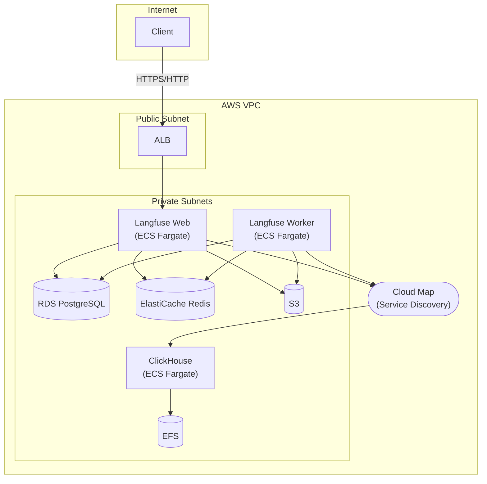

## はじめに

[Langfuse](https://langfuse.com/) は、LLMアプリケーションのための Observability プラットフォームです。トレース、評価、プロンプト管理などの機能を提供し、LLMアプリの開発・運用を支援します。

Langfuse はクラウドサービス版も提供されていますが、データプライバシーやコスト面からセルフホスティングを選択するケースもあります。

### モチベーション

Langfuse 公式の [Self-Hosting Guide](https://langfuse.com/self-hosting/deployment/aws) では、[langfuse-terraform-aws](https://github.com/langfuse/langfuse-terraform-aws) という Terraform モジュールが紹介されています。しかし、以下の点が課題でした：

1. **EKS (Kubernetes) 依存**: Helm でリソースをデプロイするため、Kubernetes の運用スキルが必要。検証や小規模環境ではオーバースペック。
2. **ドメイン + ACM 証明書が必須**: 開発・検証段階でもドメイン取得と証明書発行が必要で、手軽に試せない。
3. **コストが高め**: Aurora PostgreSQL や NAT Gateway（月額約 $45 の固定費 + データ処理料金 $0.062/GB）を使用しており、[約 $450/月〜](https://www.gao-ai.com/post/langfuse-on-aws-with-terraform)のコストがかかる。

そこで、**ECS Fargate ベースでシンプルに運用でき、ドメインなしでも動作し、コストを抑えた** Terraform モジュールを作成しました。

### 本プロジェクトの概要

[terraform-aws-langfuse-ecs](https://github.com/myui/terraform-aws-langfuse-ecs) は、Apache License 2.0 で公開している OSS の Terraform モジュールです。以下の特徴があります：

- **Kubernetes 不要**: ECS Fargate でシンプルに運用
- **ドメイン/証明書はオプション**: 自己署名証明書で検証可能
- **コスト最適化**: RDS PostgreSQL、ARM64 (Graviton)、VPC Endpoints で低コスト
- **VPC 自動作成**: 既存 VPC も利用可能

本記事では、このモジュールを使って AWS 上に Langfuse v3 をデプロイする方法を紹介します。

## 公式 Terraform モジュールとの比較

Langfuse 公式では [langfuse-terraform-aws](https://github.com/langfuse/langfuse-terraform-aws) という Terraform モジュールが提供されています。

しかし、公式モジュールには以下の特徴があります：

- **EKS (Kubernetes) ベース**: Helm でリソースをデプロイするため、Kubernetes の運用スキルが必要
- **ドメイン + ACM 証明書が必須**: 検証段階でもドメイン取得・証明書発行が必要
- **Aurora PostgreSQL**: 高可用性だがコストが高め

検証や小〜中規模の本番環境では、これらがオーバースペックになることがあります。

### 比較表

| 項目 | 公式 (langfuse-terraform-aws) | 本プロジェクト |
|------|------------------------------|----------------|
| コンピュート | EKS (Helm) | ECS Fargate |
| データベース | Aurora PostgreSQL | RDS PostgreSQL |
| CPU アーキテクチャ | x86_64 / ARM64 | ARM64 (Graviton) |
| ドメイン/証明書 | 必須 | オプション（自己署名証明書対応） |
| VPC の外部通信 | NAT Gateway | VPC Endpoints |
| 想定用途 | 本番環境 | 開発/検証/小〜中規模本番 |
| 運用スキル | Kubernetes 必要 | 不要 |
| 月額コスト目安 | [約$450〜](https://www.gao-ai.com/post/langfuse-on-aws-with-terraform) | 約$130〜 |
| スケールアップガイド | - | RDS 移行ガイドあり |

## 本プロジェクトの特徴

### 1. Kubernetes 不要

ECS Fargate を採用し、コンテナのオーケストレーションを AWS マネージドサービスに任せています。Kubernetes のクラスター管理やバージョンアップ対応が不要です。

### 2. ドメイン/証明書がオプション

開発・検証段階では、自己署名証明書で HTTPS アクセスが可能です。本番環境では ACM 証明書 + カスタムドメインを設定できます。

### 3. コスト最適化

- **RDS PostgreSQL**: Aurora より低コスト
- **ARM64 (Graviton)**: x86_64 比で約20%のコスト削減
- **VPC Endpoints**: NAT Gateway 不要で固定費を削減
- **S3 Intelligent-Tiering**: ストレージコストを自動最適化

## アーキテクチャ概要



### 設計ポイント

#### ECS Fargate + Cloud Map によるサービス検出

ClickHouse への接続には AWS Cloud Map（ECS Service Discovery）を使用しています。`clickhouse.langfuse.local` という内部 DNS 名で名前解決され、ECS タスクの再起動時も自動的に DNS レコードが更新されます。

#### VPC Endpoints で NAT Gateway 不要

Private Subnet から AWS サービスへのアクセスには VPC Endpoints を使用しています：

- ECR（コンテナイメージ取得）
- CloudWatch Logs（ログ配信）
- Secrets Manager（シークレット取得）
- S3（Blob ストレージ）

NAT Gateway の月額固定費（約 $45/月）+ データ処理料金を削減できます。

#### ARM64 (Graviton) でコスト最適化

ECS タスク、RDS、ElastiCache すべてで ARM64 (Graviton) プロセッサを使用しています。x86_64 と比較して約20%のコスト削減が見込めます。

## 使い方

### 前提条件

- Terraform >= 1.0
- AWS CLI（認証設定済み）
- Docker（イメージの ECR への push 用）

### クイックスタート

```bash
# 1. リポジトリをクローン
git clone https://github.com/myui/terraform-aws-langfuse-ecs.git
cd terraform-aws-langfuse-ecs

# 2. tfvars ファイルを作成
cp tfvars/example.tfvars tfvars/dev.tfvars
# tfvars/dev.tfvars を編集

# 3. ECR リポジトリを作成
aws ecr create-repository --repository-name langfuse-dev/web
aws ecr create-repository --repository-name langfuse-dev/worker
aws ecr create-repository --repository-name langfuse-dev/clickhouse

# 4. コンテナイメージを ECR に push
./scripts/push-images.sh <aws_account_id> <aws_region> langfuse-dev

# 5. Terraform 実行
cd infra
terraform init
terraform apply -var-file=../tfvars/dev.tfvars
```

詳細な手順は [README](https://github.com/myui/terraform-aws-langfuse-ecs) を参照してください。

### 設定例

```hcl
# tfvars/dev.tfvars
aws_region   = "ap-northeast-1"
service_name = "langfuse"
user         = "your-name"

# Container Images (ECR URLs)
langfuse_web_image    = "123456789012.dkr.ecr.ap-northeast-1.amazonaws.com/langfuse-dev/web:3"
langfuse_worker_image = "123456789012.dkr.ecr.ap-northeast-1.amazonaws.com/langfuse-dev/worker:3"
clickhouse_image      = "123456789012.dkr.ecr.ap-northeast-1.amazonaws.com/langfuse-dev/clickhouse:24"

# VPC 自動作成（既存 VPC を使う場合は vpc_id を指定）
vpc_cidr = "10.0.0.0/16"

# アクセス制限（IP 範囲）
allowed_cidrs = ["203.0.113.0/24"]

# 内部 AWS サービスからの tracing API アクセス（オプション）
# allowed_security_group_ids = ["sg-xxxxxxxxx"]
```

## スケールアップへの対応

本プロジェクトは小規模構成から始められますが、負荷に応じてスケールアップ可能です。

### RDS インスタンスクラスの変更

```hcl
# tfvars/dev.tfvars
db_instance_class = "db.t4g.small"  # micro → small
db_multi_az       = true             # 高可用性が必要な場合
```

### ECS タスクのリソース増強

```hcl
web_cpu    = 2048  # 2 vCPU
web_memory = 4096  # 4 GB

worker_desired_count = 2  # Worker を2台に
```

RDS の詳細な移行手順については、リポジトリ内の移行ガイドを参照してください。

## コスト見積もり

東京リージョンでの最小構成の概算（月額）：

| サービス | 構成 | 概算コスト |
|----------|------|------------|
| ECS Fargate | 3 タスク (Web/Worker/ClickHouse) | 〜$100 |
| RDS PostgreSQL | db.t4g.micro | 〜$15 |
| ElastiCache Redis | cache.t4g.micro | 〜$12 |
| EFS | 10 GB | 〜$3 |
| S3 | 10 GB | 〜$1 |
| **合計** | | **〜$130/月** |

※ データ転送量、CloudWatch ログ等は含まれていません。

## まとめ

本プロジェクトは、Langfuse を AWS 上でシンプルかつ低コストにセルフホスティングするための Terraform モジュールです。

- **EKS 不要**: ECS Fargate でシンプルに運用
- **ドメイン不要**: 自己署名証明書で検証可能
- **コスト最適化**: RDS、ARM64、VPC Endpoints で月額〜$130〜

大規模な本番環境では公式の EKS ベースのモジュールが適していますが、開発・検証環境や小〜中規模の本番環境では、本プロジェクトがシンプルな選択肢になります。

ぜひ試してみてください。フィードバック歓迎です！

https://github.com/myui/terraform-aws-langfuse-ecs

## 参考リンク

- [Langfuse 公式ドキュメント](https://langfuse.com/docs)
- [Langfuse Self-Hosting Guide](https://langfuse.com/self-hosting)
- [langfuse-terraform-aws（公式）](https://github.com/langfuse/langfuse-terraform-aws)
- [Langfuse on AWS with Terraform - Gao Inc](https://www.gao-ai.com/post/langfuse-on-aws-with-terraform)
- [NAT Gatewayのコストについて - DevelopersIO](https://dev.classmethod.jp/articles/vpc-nat-gateway-cloudwatch-dashbord/)
